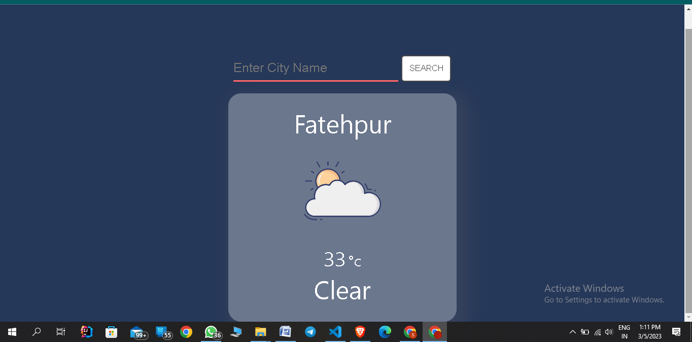

# Weather_app

 This weather app is by the help of html css and javascript.The features of the weather app is that when you open the application then it tell the weather of your current position and it can also tell the weather of any particular city.The search button hover effect is also amazing with the help of CSS

  

